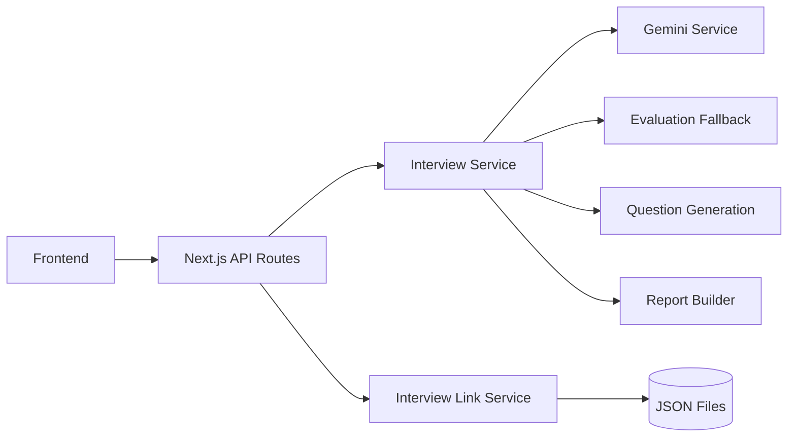

# Intervu AI

Intervu AI is an adaptive AI technical interview platform for recruiters and candidates. Recruiters create shareable interview links; candidates complete a personalized, curriculum-aware interview without dashboard access; AI evaluates each answer and generates a structured report.

## Overview

Traditional technical interviews are inconsistent, hard to scale, and often fail to probe depth when a candidate gives a shallow answer. Recruiters need a repeatable way to assess candidates while candidates need fair, structured practice.

Intervu AI runs an adaptive interview engine that:

- Personalizes questions from candidate profile and curriculum progress
- Evaluates every answer with Gemini when available
- Asks intelligent follow-ups (up to 2 per topic) when answers are weak or incomplete
- Caps interviews at **8 main questions** while keeping adaptive follow-ups separate
- Degrades gracefully when Gemini is unavailable
- Produces recruiter-ready reports with scores, strengths, and improvement areas

## Key Features

- Candidate profiling from learning history and skills
- Curriculum-aware question generation
- Adaptive follow-ups based on answer quality
- AI evaluation with structured feedback
- Structured interview reports
- Recruiter dashboard
- Shareable candidate interview links
- Graceful AI fallback when Gemini fails or quota is exhausted

## Architecture



Flow:

Frontend → Next.js API → Interview Service → Gemini Service → Evaluation / Follow-up / Report Services

## Tech Stack

- **Next.js 16** (App Router)
- **React 19**
- **TypeScript**
- **Tailwind CSS 4**
- **Google Gemini** (`@google/genai`)
- **Zod**, **React Hook Form**, **Framer Motion**, **Sonner**

## Project Structure

| Path | Purpose |
|------|---------|
| `app/` | Pages and API routes |
| `app/api/interview/` | Start, answer, create, link, session, report endpoints |
| `app/dashboard/` | Recruiter dashboard |
| `app/interview/session/` | Candidate interview UI |
| `app/report/` | Interview report UI |
| `components/` | Shared UI and interview/report components |
| `lib/services/` | Interview engine, Gemini, links, reports |
| `lib/prompts/` | AI prompt templates |
| `data/` | Candidates, curriculum, interview links (demo persistence) |
| `types/` | Shared TypeScript types |
| `utils/constants.ts` | Interview limits (`MAX_TOTAL_QUESTIONS = 8`) |

## Environment Variables

Copy `.env.example` to `.env.local`:

```bash
cp .env.example .env.local
```

Required variable names:

- `GOOGLE_GENERATIVE_AI_API_KEY`

Optional variable names:

- `GEMINI_API_KEY`
- `GOOGLE_CLOUD_PROJECT`
- `GOOGLE_CLOUD_PROJECT_NUMBER`

The codebase accepts `GEMINI_API_KEY` as a legacy alias. Never commit real keys.

## Local Development

```bash
npm install
npm run dev
```

Open [http://localhost:3000](http://localhost:3000).

## Type Checking

```bash
npx tsc --noEmit
```

## Production Build

```bash
npm run build -- --webpack
```

## Deployment

### Vercel

1. Push code to GitHub.
2. Import the repository into [Vercel](https://vercel.com).
3. Add environment variables (`GOOGLE_GENERATIVE_AI_API_KEY`).
4. Deploy.
5. Test the production URL: dashboard → create interview → open candidate link → complete interview → view report.

### Important: Persistence Limitation

Interview sessions and links are stored in local JSON files under `data/` via the filesystem. This works for local development and single-instance demos, but **is not production-safe on Vercel serverless** because:

- Serverless functions have ephemeral / read-only filesystems
- Multiple instances do not share local file state

For production, migrate persistence to a database (PostgreSQL, Supabase, Redis, etc.). The current implementation is suitable for hackathon demos when run locally or on a single persistent server.

## How It Works

1. Recruiter opens **Dashboard**
2. Selects a candidate
3. Clicks **Create Interview**
4. Copies the generated link
5. Candidate opens the link (no recruiter access needed)
6. Candidate receives a valid first question
7. Candidate answers 8 main curriculum questions
8. Adaptive follow-ups can appear when an answer needs clarification, without increasing the main-question count
9. The final answer completes the interview
10. Recruiter views the report (`/report?token=...`)

## API Overview

| Endpoint | Method | Description |
|----------|--------|-------------|
| `/api/interview/create` | POST | Create interview link for a candidate |
| `/api/interview/start` | POST | Start or resume interview (`candidateId` or `token`) |
| `/api/interview/answer` | POST | Submit answer, evaluate, return next question |
| `/api/interview/session` | GET/PUT | Load or save session by `sessionId` |
| `/api/interview/link` | GET | Validate interview token |
| `/api/interview/links` | GET | Latest link for a candidate |
| `/api/interview/report-by-token` | GET | Recruiter report by token |
| `/api/candidates` | GET | Candidate list |

### Answer API Response (success)

```json
{
  "success": true,
  "sessionId": "...",
  "evaluation": { "score": 7, "feedback": "...", "isFinalQuestion": false },
  "nextQuestion": { "...": "..." },
  "currentQuestionNumber": 2,
  "totalQuestions": 8,
  "status": "active",
  "sessionState": { "...": "..." }
}
```

## Future Improvements

- Database persistence and multi-instance support
- Recruiter authentication and accounts
- Analytics and hiring pipeline integration
- Voice interviews
- Anti-cheating signals
- Stronger evaluation benchmarks and rubrics

## Security

- Gemini keys are read only in server-side services and API routes.
- No `NEXT_PUBLIC_*` secrets are required.
- API routes return safe error messages while logging diagnostics server-side.
- `.env*`, `.next`, `node_modules`, build output, and credentials are ignored by git.

## License

Private hackathon project.
