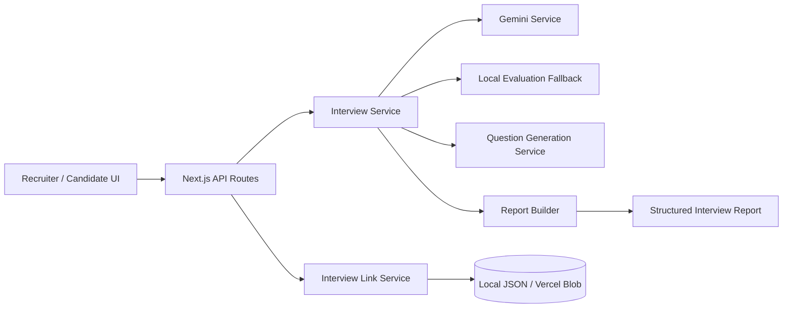

# Intervu AI

Intervu AI is an adaptive AI technical interview platform for recruiters and candidates. Recruiters create shareable interview links; candidates complete personalized, curriculum-aware interviews without dashboard access; the AI evaluates answers, asks adaptive follow-ups, and produces a structured recruiter report.

## Problem

Traditional technical interviews can be inconsistent and difficult to scale. A candidate may give a shallow answer, but a fixed question list usually cannot probe the missing concepts or adapt the difficulty.

Intervu AI addresses this with an adaptive interview engine that combines candidate learning history, curriculum progress, answer evaluation, and follow-up decisions.

## Key Features

- Candidate profiling from learning history and skills
- Curriculum-aware technical questions
- Adaptive follow-up questions based on answer quality
- Difficulty adaptation between easy, medium, and hard questions
- Up to 2 follow-ups per main curriculum topic
- 8-question main interview cap
- Gemini-powered answer evaluation and question decisions
- Graceful local evaluation fallback when Gemini is unavailable or quota is exhausted
- Recruiter dashboard with candidate progress and interview status
- Shareable candidate interview links
- Structured interview reports with scores, strengths, improvements, and missing concepts
- Candidate interview flow without recruiter dashboard access

## How the Interview Works

1. Recruiter opens the dashboard.
2. Recruiter selects a candidate and creates an interview link.
3. Candidate opens the shared link.
4. The system builds the interview from the candidate profile and curriculum progress.
5. The candidate answers the current technical question.
6. Gemini evaluates the answer and decides whether to ask a follow-up, move to the next topic, change difficulty, or finish.
7. Follow-up questions do not increase the main-question counter.
8. After the final main question, the interview is marked completed.
9. The recruiter can open the generated report from the dashboard.

## Architecture



Main flow:

`Frontend → Next.js API → Interview Service → Gemini / Fallback → Next Question → Report`

## Tech Stack

- **Next.js 16** — App Router and API routes
- **React 19**
- **TypeScript**
- **Tailwind CSS 4**
- **Google Gemini** via `@google/genai`
- **Framer Motion** — UI animations
- **Lucide React** — icons
- **Zod / React Hook Form** — validation and forms
- **Vercel Blob** — production interview-link persistence when configured

## Project Structure

| Path | Purpose |
|------|---------|
| `app/` | Application pages and API routes |
| `app/api/interview/` | Interview creation, start, answer, session, link, and report APIs |
| `app/dashboard/` | Recruiter dashboard |
| `app/interview/` | Candidate interview entry flow |
| `app/interview/session/` | Live candidate interview UI |
| `app/report/` | Interview report UI |
| `components/` | Shared UI and interview/report components |
| `lib/services/` | Interview engine, Gemini, question generation, links, evaluation, and reports |
| `lib/prompts/` | AI prompt templates |
| `data/` | Demo candidate/curriculum data and local interview-link persistence |
| `types/` | Shared TypeScript types |
| `utils/constants.ts` | Interview limits such as `MAX_TOTAL_QUESTIONS = 8` |

## Environment Variables

Create `.env.local` from `.env.example`:

```bash
cp .env.example .env.local
```

Required:

```env
GOOGLE_GENERATIVE_AI_API_KEY=your_gemini_api_key
```

Optional:

```env
GEMINI_API_KEY=your_gemini_api_key
GOOGLE_CLOUD_PROJECT=your_project_id
GOOGLE_CLOUD_PROJECT_NUMBER=your_project_number
BLOB_READ_WRITE_TOKEN=your_vercel_blob_token
```

`GEMINI_API_KEY` is supported as a legacy alias. Never commit real API keys.

## Local Development

Install dependencies:

```bash
npm install
```

Start the development server:

```bash
npm run dev
```

Open:

`http://localhost:3000`

## Validation

Run TypeScript checking:

```bash
npx tsc --noEmit
```

Run the production build:

```bash
npm run build
```

The project currently builds successfully with Next.js production build and TypeScript validation.

## API Overview

| Endpoint | Method | Description |
|----------|--------|-------------|
| `/api/candidates` | GET | Load candidate data |
| `/api/interview/create` | POST | Create a shareable interview link |
| `/api/interview/start` | POST | Start or resume an interview using a candidate ID or token |
| `/api/interview/answer` | POST | Submit an answer and receive evaluation/next-question data |
| `/api/interview/session` | GET/PUT | Load or save an interview session |
| `/api/interview/link` | GET | Validate an interview token |
| `/api/interview/links` | GET | Load the latest interview link for a candidate |
| `/api/interview/report` | GET/POST | Interview report operations |
| `/api/interview/report-by-token` | GET | Load a report using an interview token |
| `/api/debug/gemini` | GET | Server-side Gemini connectivity/debug check |

### Example Answer Response

```json
{
  "success": true,
  "sessionId": "...",
  "evaluation": {
    "score": 7,
    "feedback": "...",
    "isFinalQuestion": false
  },
  "nextQuestion": {
    "id": "...",
    "prompt": "..."
  },
  "currentQuestionNumber": 2,
  "totalQuestions": 8,
  "status": "active",
  "sessionState": {
    "currentTopicIndex": 1,
    "followUpCountForCurrentTopic": 0,
    "totalQuestionsAsked": 1,
    "mainTopicsCompleted": 1
  }
}
```

## AI Evaluation and Fallback

The application first attempts Gemini-powered adaptive evaluation.

If Gemini is unavailable, rate-limited, or its quota is exhausted, the interview does not have to stop. The interview service uses a local evaluation fallback and continues with a safe next-question strategy.

This is especially useful during demos because Gemini free-tier quotas can be exhausted during repeated testing.

## Persistence

For local development, interview-link data can be stored in:

```text
data/interview-links.json
```

When running on Vercel, the application is configured to use Vercel Blob for interview-link persistence when `BLOB_READ_WRITE_TOKEN` is available. This avoids relying on Vercel's ephemeral/read-only filesystem.

For a larger production system, a database such as PostgreSQL or Supabase would still be preferable for concurrent sessions, reporting, analytics, authentication, and transactional consistency.

## Deployment

### Vercel

1. Push the project to GitHub.
2. Import the repository into Vercel.
3. Add `GOOGLE_GENERATIVE_AI_API_KEY` to the Vercel project environment variables.
4. If using Vercel Blob persistence, connect a Blob store and make sure `BLOB_READ_WRITE_TOKEN` is available in the deployment environment.
5. Deploy the project.
6. Test the complete flow:
   - Dashboard
   - Select candidate
   - Create interview
   - Open candidate link
   - Answer questions
   - Complete interview
   - Open recruiter report

Do not expose Gemini or Blob credentials through `NEXT_PUBLIC_*` variables.

## Security

- Gemini API keys are used only by server-side services/API routes.
- No `NEXT_PUBLIC_*` secret is required.
- Interview links use generated tokens rather than exposing candidate data directly in the URL.
- API responses sanitize recruiter/candidate link data where appropriate.
- Detailed Gemini diagnostics are logged server-side rather than returned as raw errors to users.
- `.env*`, `.next`, `node_modules`, build output, and credentials should remain excluded from Git.

## Hackathon Demo Checklist

Before the final demo:

- [ ] `npm run build` passes
- [ ] Gemini debug endpoint responds successfully
- [ ] Dashboard loads candidates
- [ ] Interview link can be created
- [ ] Candidate can open the link without dashboard access
- [ ] Main question counter reaches the configured limit correctly
- [ ] Follow-up questions do not incorrectly increase the main-question count
- [ ] Gemini quota/error fallback keeps the interview usable
- [ ] Completed interview changes the recruiter status to **Completed**
- [ ] Recruiter can open the final report
- [ ] No API key is committed to GitHub

## Future Improvements

- PostgreSQL/Supabase persistence for full production support
- Recruiter authentication and role-based access
- Hiring pipeline and analytics
- Voice-based interviews
- Anti-cheating and integrity signals
- Stronger evaluation benchmarks and rubric calibration
- Candidate comparison and recruiter analytics

## License

Private hackathon project.
